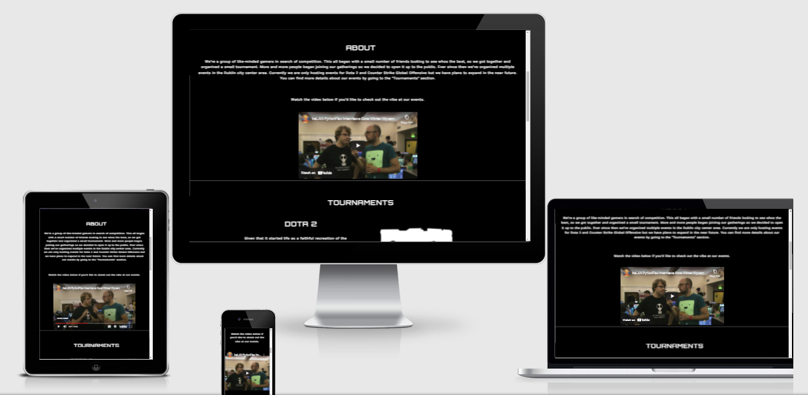
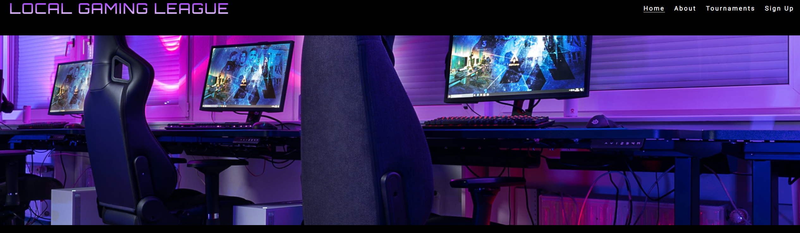
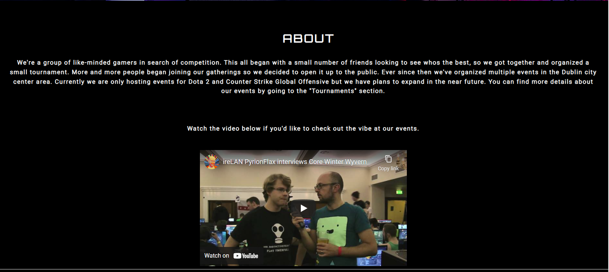
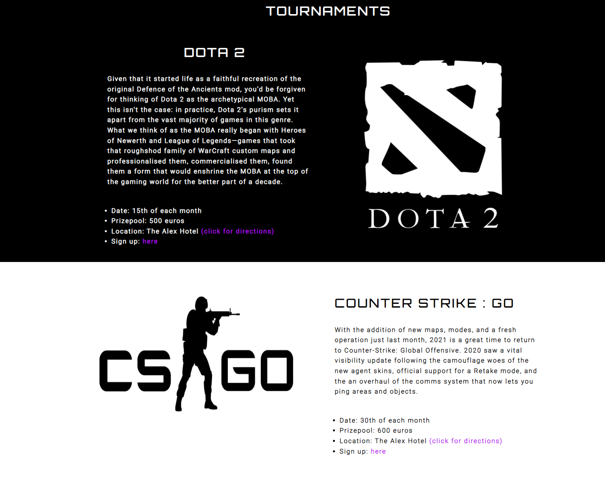
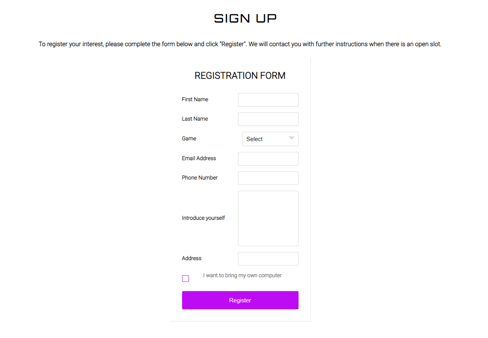
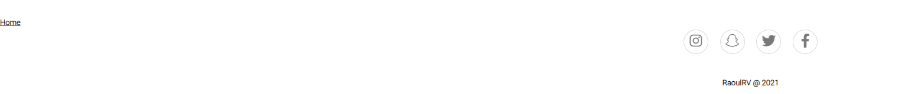

# Local Gaming League
Local Gaming League is a website for people who enjoy competitive online videogames and wish to compete in small "grassroots" tournaments. It offers organized events for in-person gaming and competitions with small prizepools. 

These events are held monthly and it currently supports two videogames, Dota 2 and Counter-Strike Global Offensive.
Users of the website are able to read about the begginings of the Local Gaming League, watch videos taken at one of the events, get detailed information about the videogames being played , the location and the prizepool.

The users are also able to sign up for the specific videogame tournament they prefer by adding their information in the sign-up form. The website is targeted at both veteran and novice gamers who wish to play against eachother in-person.

# Features

**Header & Navigation**

- At the top left of the page the navigation shows the name of the website : Local Gaming League this doubles as a "Home" button as it links to the top of the page. 

- The navigation menu is located at the top right of the page, its made up of : Home, About, Tournaments and Sign Up. 

- All these navigation buttons link down to their specific section on the same page. This makes the website very accessible and its clear for the user where to access different sections of the page.
- The navigation uses a futuristic font which reminds people of old arcade videogames.
- The image is related to the purpose of the website, which is gaming.
- The website name color is a purple gradient which contrasts well with the background but also compliments the image which is also predominantly purple.
- This section starts setting the tone for the rest of the page, already showing the main color scheme: Purple, White and Black.

**About Section**

- The About section provides the user with an introduction to the Local Gaming League.

- The About section also contains a video which introduces the user to the atmosphere at one of the events , this is done in order for the user to decide if he would like to participate.

- This section provides valuable information about which types of games you can sign up for, where the tournaments are located and if there any more supported games in the future.

**Tournaments Section**

- The Tournaments section is intended to provide more specific information about the 2 videogames Local Gaming League supports.

- It is split into 2 sub sections, Dota 2 and Counter Strike : GO. This is done so the user can more clearly distinguish between the two and read about the games.

- In both sub sections there is a list of specific information about the tournaments. This information cosists of : Date, Prizepool, Location and where to sign up.

- In the location part there is an external link to the specific location on the map, this opens a new tab with directions. There is also a back-up link to the sign up section below in case the user doesn't know where to sign up.

- The Tournaments section allows the user to learn concrete information about tournament details.

**Sign Up Section**

- The sign up section contains a small description of the section and how to use it. This is incase the user is confused about how to sign up to our events.

- The main part of the section is a horizontal registration form with 8 elements: First Name, Last Name, Game, Email Address, Phone Number, Introduction, Address and a tickbox.

- The Game field has a drop-down where the user can select which game tournament they would like to sign up for.

- The form has purple accents to fit with the rest of the websites color scheme.

- The tickbox is intended to inform Local Gaming League if the user wishes to bring their own computer to the events.

- The form is important because its the main way for the user to sign up for Local Gaming League events.

**Footer Section**

- In this section the user is presented with social media links in form of icons, this is important for the user to stay in touch with Local Gaming League.

- The section also has a Home button which links to the top of the page. This is important for the user to easily return to the top of the page without having to scroll.

- The footer section is valuable to because it gives the user opportunities to stay updated about Local Gaming League.

