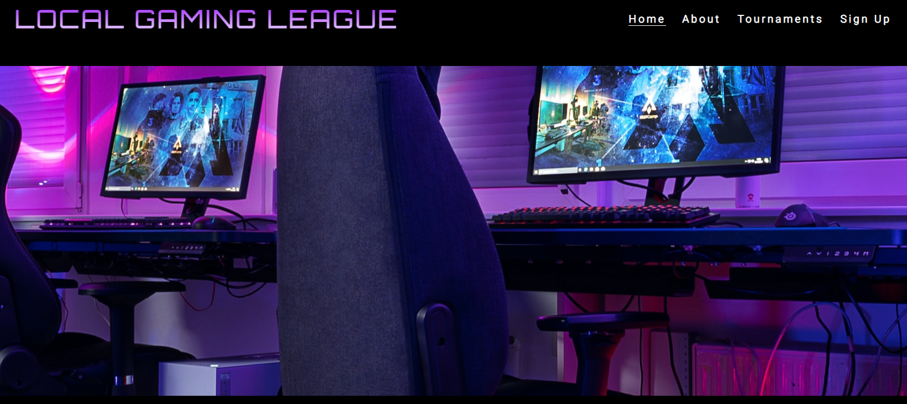

# Local Gaming League
Local Gaming League is a website for people who enjoy competitive online videogames and wish to compete in small "grassroots" tournaments. It offers organized events for in-person gaming and competitions with small prizepools. 

These events are held monthly and it currently supports two videogames, Dota 2 and Counter-Strike Global Offensive.
Users of the website are able to read about the begginings of the Local Gaming League, watch videos taken at one of the events, get detailed information about the videogames being played , the location and the prizepool. The users are also able to sign up for the specific videogame tournament they prefer by adding their information in the sign-up form. The website is targeted at both veteran and novice gamers who wish to play against eachother in-person.

# Features

**Header & Navigation**

- At the top left of the page the navigation shows the name of the website : Local Gaming League this doubles as a "Home" button as it links to the top of the page. 

- The navigation menu is located at the top right of the page, its made up of : Home, About, Tournaments and Sign Up. 

- All these navigation buttons link down to their specific section on the same page. This makes the website very accessible and its clear for the user where to access different sections of the page.
- The navigation uses a futuristic font which reminds people of old arcade videogames.
- The image is related to the purpose of the website, which is gaming.
- The website name color is a purple gradient which contrasts well with the background but also compliments the image which is also predominantly purple.
- This section starts setting the tone for the rest of the page, already showing the main colors: Purple, White and Black.

